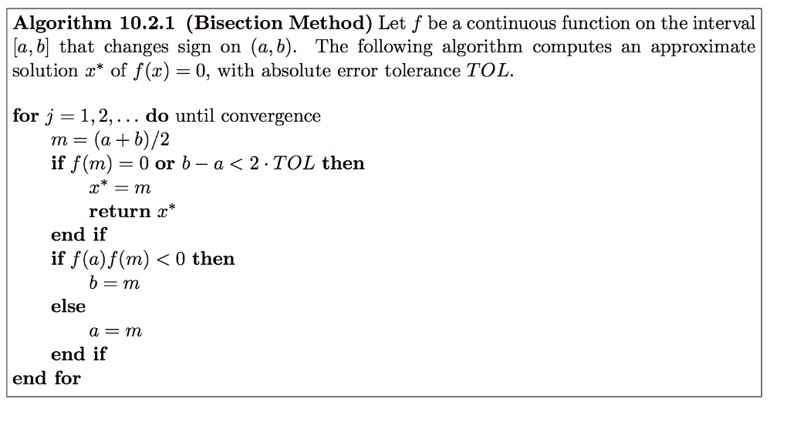
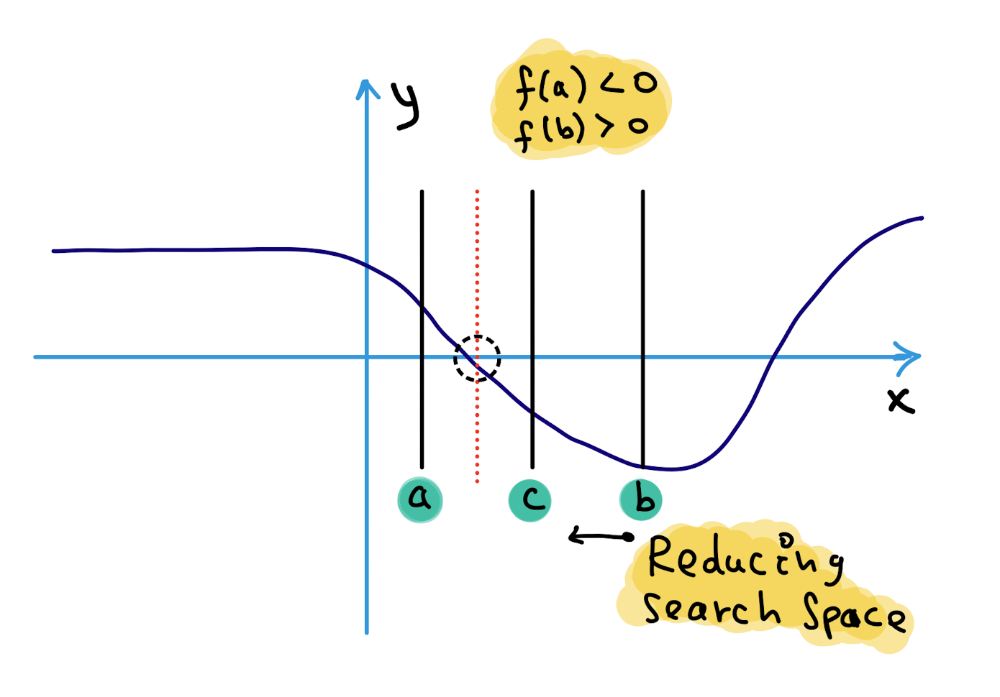
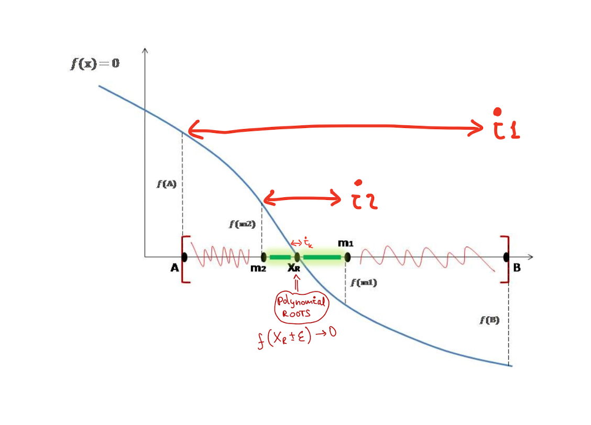

# Bisection Method [se1:ch2]


Consider the following scenario: we have a nonlinear equation and are attempting to solve it using a computer program. For the nonlinear equation, what strategy can the CPU employ in order to compute a solution? Alternatively, from what point of view would we address that challenge in terms of efficacy?

In light of the fundamental architecture of the CPU, how can we develop an algorithm for finding a solution to this problem?

Following the development of an algorithm, we will apply the answer to that problem to substantial challenges like **Binary Search**.

Before diving into the algorithm, there are some edge cases we need to analyze.

**case1**: Let's pretend we have a function that looks like this, and it has crossed the Ox axis once.:

<p align="center">

</p>

**T1**: We know from mathematics that if a function is real, continuous, and changes sign between two points, then there must be at least one root between the two points in the function's domain.

**case2**: The function has roots, but the sign of the function has not changed between points.

<p align="center">

</p>

**T2**: It's possible that roots of the equation f(x) = 0 still exist between two positions where f(x) doesn't change sign between xl and xu points.

**case3**: Any real root of the function does not exist; in addition, there is no change in its sign from one point to the next.

<p align="center">


</p>
**T3**: It's possible that roots of the equation f(x) = 0 don’t exist between two positions where f(x) doesn't change sign between xl and xu points.

**case4**: There may be more than one root for the equation between two points if the function changes the sign between them. If the function changes the sign between two points, there may be more than one root for the equation between them.

<p align="center">

</p>

> The core intuition behind numerical approaches is based on approximation & convergence, as we discussed in the previous chapter.
> 

The TOL error notion is not important to this chapter; we'll cover error analysis in a later chapter.

<p align="center">

</p>

```cpp
#include<bits/stdc++.h>
using namespace std;
#define TOL 0.01 // threshold for error
 
// An example function whose solution is determined using
// Bisection Method. The function is x^3 - x^2  + 2
double func(double x)
{
    return x*x*x - x*x + 2;
}
 
// Prints root of func(x) with error of TOL
void bisection(double a, double b)
{
    if (func(a) * func(b) >= 0)
    {
        cout << "You have not assumed right a and b\n";
        return;
    }
 
    double c = a;
    while ((b-a) >= TOL)
    {
        // Find middle point
        c = (a+b)/2;
 
        // Check if middle point is root
        if (func(c) == 0.0)
            break;
 
        // Decide the side to repeat the steps
        else if (func(c)*func(a) < 0)
            b = c;
        else
            a = c;
    }
    cout << "The value of root is : " << c;
}
 
// Driver program to test above function
int main()
{
    // Initial values assumed
    double a =-200, b = 300;
    bisection(a, b);
    return 0;
} 
```

<p align="center">


</p>

Pros & Cons of using the bisection approach:

**Pros**:
1. The bisection approach is always convergent, regardless of the situation. Due to the fact that the approach brackets the root, the method is certain to converge.
2. As the number of repetitions is increased, the interval is reduced by half. As a result, the inaccuracy in the solution of the equation may be guaranteed.

**Cons**:
1. The convergence of the bisection method is slow as it is simply based on halving
the interval.

2. If one of the initial guesses is closer to the root, it will take a larger number of
iterations to reach the root.

In the next chapter, we will discuss error analysis.