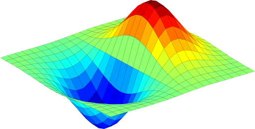

# Numerical Methods - need [se1:ch1]

Have you ever wondered how computer software determines the square root of a given value?

> "Computational thinking vs. Human thinking" is the equivalent of this question.

Doing the math on paper is different from CPU. By design, computers solve problems iteratively. Innate methods must be adapted in order to deal with such a situation.
This article's primary goal is to foster intuition:
1. Understand the requirement for numerical methods
2. Go through the processes of solving a specific problem (mathematical modeling, solution, and implementation).

Solving engineering challenges necessitates the use of mathematical models. These mathematical models might be generated from actual data or from concepts found in engineering and science. A wide variety of mathematical methods, such as differentiation, nonlinear equations, simultaneous linear equations, curve fitting by interpolation or regression, integration, and differential equations are frequently required when building mathematical models. Some of these mathematical operations can be solved precisely, as you probably learned to do in your calculus studies, but for the most part, they must be approximated numerically. Approximate answers to mathematical problems are provided by numerical methods. These issues might arise in any engineering discipline. As a result, any answer you acquire using these methods will be approximate rather than accurate. However, they provide the solution more quickly than standard approaches and are also simple to program.

**The main applications of numerical methods are:**

- Adaptive computation (we will discuss this topic separately)
- Solving linear and nonlinear equations and determining the true roots. There are several ways available, such as bisection, Newton-Raphson, and so on.
- Any value in the range of a table of values may be obtained by using interpolation. It is capable of resolving readings with equal spacing, and Newton's general technique is inferred for ways with uneven spacing.
- A good estimate and a simple approach are to fit certain points to a curve.
- On the basis of the assumption that integration can be computed using a simple procedure, the definite integral is the area enclosed by the given curve. These approaches are quite good at estimating the area. There are a variety of techniques, such as Simpson's rule.
- Solving partial differential equations.

As an engineer or scientist, you will employ numerical methods to address an issue. Let's have a look at an example of this in action. As a starting point, let's take a look at the stages that go into fixing an engineering issue. In order to begin, you must first identify the problem. Defining the problem is the first step in solving it since if you don't know-how, you won't be able to. You need to write a detailed explanation of the issue you're dealing with, including what it is and what we're searching for before you can begin working on it. After that, you may create a mathematical model of it, however, others would say that an experimental model is required. That is perfectly OK. Whatever strategy you use for solving the problem will determine whether you construct a mathematical model or an experimental model. Even an experimental model must require a mathematical model at some point if the problem is to be solved or presented in an understandable manner. Using our numerical methodologies, we will limit the applicability after we've established a mathematical model. If you wish to find a solution, you'll need to work out a mathematical model.

Depending on how you solve the mathematical model, you may utilize analytical methods, numerical methods, or even a package program to accomplish your goal. When students or others think they've finished with a mathematical model, they often mistakenly believe that they've completed their work; this isn't the case for your employer or anybody else. Instead of merely searching for a mathematical answer, they want to know how you plan to put that solution into action so that the problem may be resolved.

For the next chapter, we are diving into the Bisection Analysis & Newton-Raphson Method.

