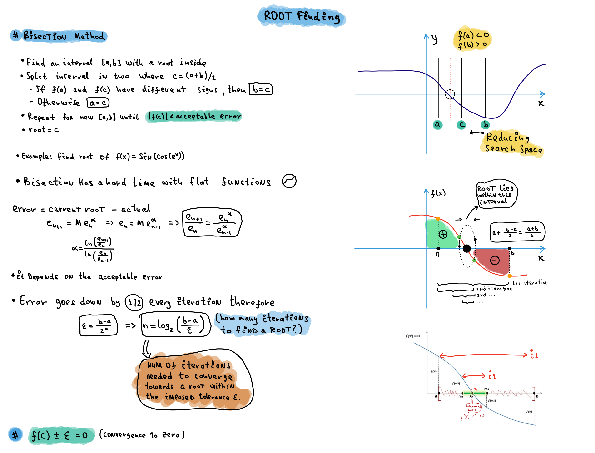

# Approximation - Error Analysis [se1:ch3]

While solving a mathematical model using numerical approaches, we can use errors to minimize errors. When doing a numerical analysis, mistakes will inevitably occur. To address the problem of errors, we must first 

1. determine the source of the error,
2. quantify the error, and then 
3. minimize the error in accordance with our requirements.

Here, we'll focus on item 2, i.e., how to measure mistakes.

What is a TRUE Error in this context? TRUE error, represented by E, is defined as the difference between the true value (also known as the precise value) and the estimated value.

> True Error = True Value - Approximate Value
> 

What is relative true error, and how does it affect you?
The ratio between the true error and the true value is symbolized by the letter t, and it is defined as the true error divided by the true value.

> Relative True Error = True Error / True Value
> 

What is approximate error? True errors are calculated only if true values are known. We will, however, most likely not have the luxury of knowing the exact numbers, as there is no reason to search for approximate values if you already know the true values. As a result, when we use numerical methods to solve an issue, we will only have access to approximate data. In these types of situations, we must understand how to measure inaccuracy. The amount of the estimated mistake does not indicate how serious the inaccuracy is, though.

> Approximate Error = Current Approximation - Previous Approximation
> 

> Relative Approximate Error = Approximate Error / Current Approximation
> 

