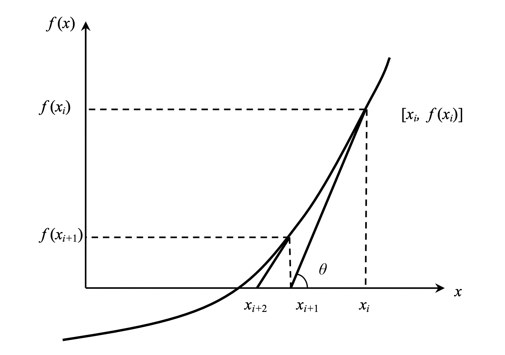

# Newton Raphson approach [se1:ch4]

Using the square-root finding technique as an example, this chapter will examine the Newton-Raphson approach in further detail. The in-depth examination and distinctions between **Gradient Descent** and **Newton-Raphson** will be the subject of a future season.
The Newton-Raphson technique is another numerical method for determining the square root. The root of a nonlinear equation must be bracketed by two estimations using methods like the bisection technique and the false position method. Bracketing approaches are used to accomplish this. Because they reduce the interval between the two estimations in order to zero in on the equation's root, these approaches are always convergent.
The root is not bracketed in the Newton-Raphson approach. When it comes to solving an equation, just one initial guess of the root is required to get the iterative process started.
As a result, it might be considered an open approach. Open approaches may or may not converge, but if they do, it will be substantially faster than with bracketing.

**Derivation**:
In general, the Newton-Raphson technique is founded on the idea that if the original estimation for the root of f(x)=0 is at xi, then drawing the tangent to the curve at f(xi) will result in a better estimate of the root, as will drawing the tangent to the curve at f(xi).
Using the definition of the slope(tangent) of a function, at x=xi.

<p align="center">

</p>

**Algorithm for this method:**
1. Compute values of f(x) and f’(x) for given initial x, f’(x) is derivative of f(x) w.r.t x
2. Compute d: d = f(x) / f’(x)
3. While d is greater than allowed error ε [iterate till the convergence]
    1. d = f(x) / f’(x)
    2. x = x – d

**Implementation:**
```cpp
// C++ program for implementation of Newton Raphson Method for
// solving equations
#include<bits/stdc++.h>
#define EPSILON 0.001 // Tolerance error
using namespace std;
 
// An example function whose solution is determined using
// Bisection Method. The function is x^3 - x^2  + 2
double func(double x)
{
    return x*x*x - x*x + 2;
}
 
// Derivative of the above function which is 3*x^x - 2*x
double derivFunc(double x)
{
    return 3*x*x - 2*x;
}
 
// Function to find the root
void newtonRaphson(double x)
{
    double h = func(x) / derivFunc(x);
    while (abs(h) >= EPSILON)
    {
        h = func(x)/derivFunc(x);
  
        // x(i+1) = x(i) - f(x) / f'(x)  
        x = x - h;
    }
 
    cout << "The value of the root is : " << x;
}
 
// Driver program to test above
int main()
{
    double x0 = -20; // Initial values assumed
    newtonRaphson(x0);
    return 0;
}
```


**Pros**:
1. It is the most efficient approach to solving nonlinear equations.
2. In addition, it may be used to solve a system of nonlinear equations, nonlinear differential equations, and nonlinear integral equations, among others.
3. As a result, this approach is relatively quick when compared to other methods due to the quadric order of convergence (i.e., of second-order).
4. It is really straightforward to implement on a computer.


**Cons**:
1. If the derivative of the function f(x) is not a simple function, then this procedure gets difficult.
2. This approach necessitates a considerable deal of care and sensitivity in the selection of its approximation parameters.
3. We must assess two values f(x) and f'(x) for some x in each iteration of the algorithm.