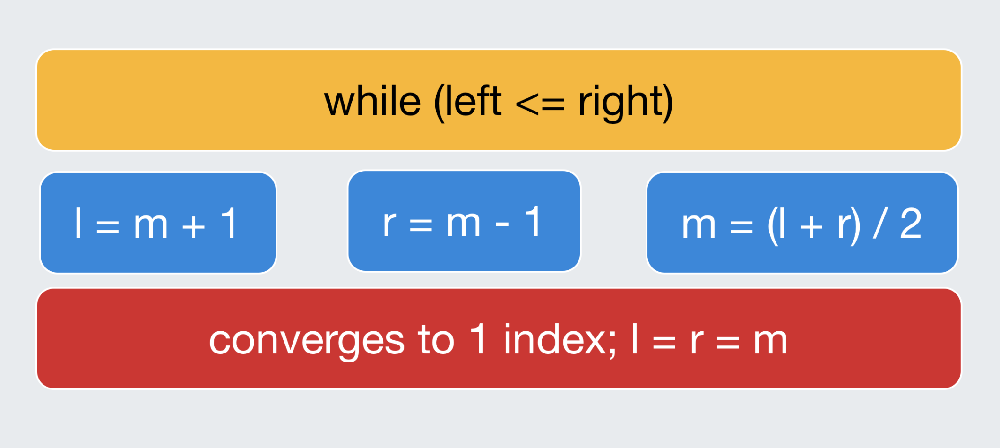
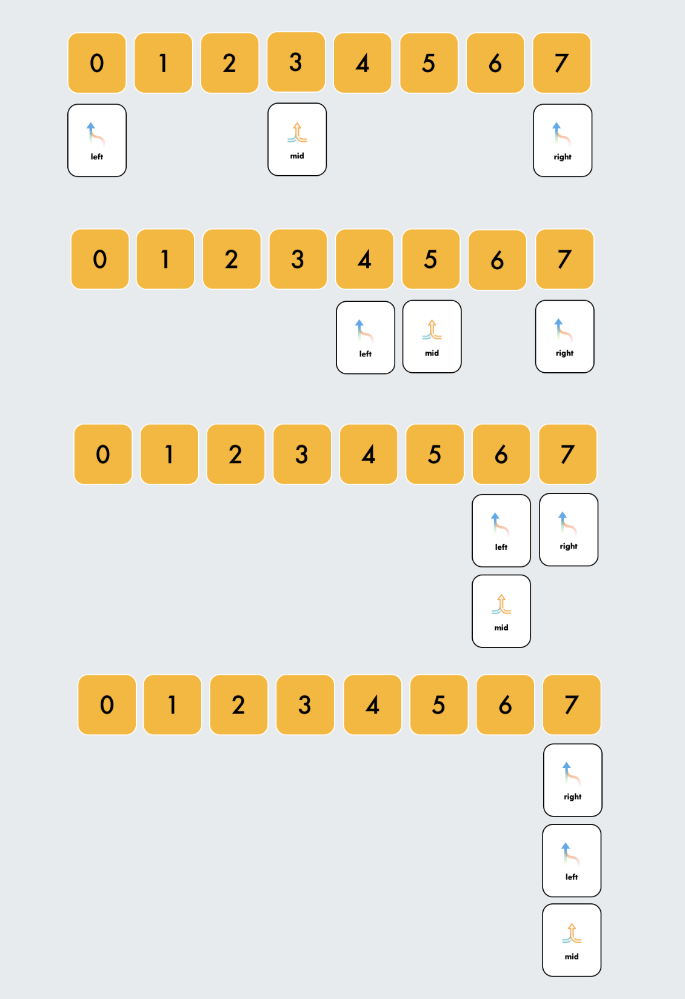

# Binary Search - survival guide [se1:ch5]

From the standpoint of difficulty, binary search is one of the most "deceptive" algorithms available:)
At first appearance, it appears to be a simple method to build and an approachable algorithm. However, when you look at the specifics, you will notice that the techniques are counter-intuitive, and this will prove to be intimidating in the long run. But there's no reason to be concerned when you know where it comes from. Over the course of chapters [1 to 4], we examined the mathematical foundations of the Binary search, including approximation methods, numerical analysis, search space reduction, and so on.
There are several terms in computer science for binary search, which is also known as half-interval, logarithmic, or binary chop. Its purpose is to locate the location of an object in an ordered array. An array is compared to its center member when using a binary search. After determining that the target value can't be found in one half, the remaining half is searched again, selecting a middle element from each half and comparing it to the target value until the target value is discovered. An empty half of the array indicates that your target was not found in the search results.
O(logn) comparisons are made in the worst-case scenario when binary search runs in logarithmic time (for sorted array). The number of entries in an array determines how many comparisons are made.
Except for tiny arrays, binary search is quicker than linear search. However, in order to use binary search, the array must first be sorted. Specialized data structures like hash tables, which can be searched more quickly than the binary search algorithm, are available. In addition to locating the next-smallest or next-largest element in the array in relation to the target, binary search may also be used to tackle a broader spectrum.

As I have stated, Binary Search is one of the “deceptive” algorithms. It’s one of the most buggy implemented algorithms in the world. Therefore, I wanted to show you the idea behind it (where it comes from). As a **bisection method [se1:ch2]**, it’s always convergent. Some historical buggy affections to the world:

[https://ai.googleblog.com/2006/06/extra-extra-read-all-about-it-nearly.html](https://ai.googleblog.com/2006/06/extra-extra-read-all-about-it-nearly.html)

[https://dev.to/matheusgomes062/a-bug-was-found-in-java-after-almost-9-years-of-hiding-2d4k](https://dev.to/matheusgomes062/a-bug-was-found-in-java-after-almost-9-years-of-hiding-2d4k)

> TLDR: There is a limit to the int data type, so when we add two really large numbers, we get an overflow and a negative value, which, when split by two, causes the issue.
> 

In **chapters [6-8]**, we are going through 3 different search space reduction scenarios.

**SCENARIO-1:** converge to the 1 element remaining in the search space. It is the most basic and elementary form of Binary Search. It is the standard Binary Search Template that most high schools or universities use when they first teach students computer science.

- Most basic and elementary form of Binary Search
- Search Condition can be determined without comparing to the element's neighbors (or use specific elements around it)
- No post-processing required because at each step, you are checking to see if the element has been found. If you reach the end, then you know the element is not found

<p align="center">

</p>

```cpp
int binarySearch(vector<int>& nums, int target){
  if(nums.size() == 0)
    return -1;

  int left = 0, right = nums.size() - 1;
  while(left <= right){
    // Prevent (left + right) overflow
    int mid = left + (right - left) / 2;
    if(nums[mid] == target){ return mid; }
    else if(nums[mid] < target) { left = mid + 1; }
    else { right = mid - 1; }
  }

  // End Condition: left > right
  return -1;
}
```

**Iterations:**
<p align="center">

</p>

For the next chapter we are going to discuss other search space scenarios.