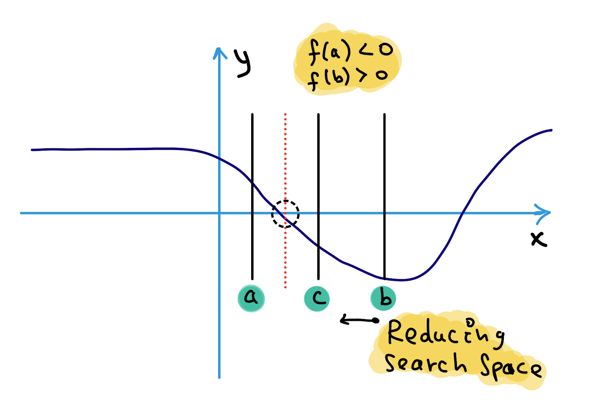

# Binary Search - survival guide [se1:ch6]

As I have stated in **[se1:ch2], [se1:ch5]**, there are different search space reduction scenarios.
<p align="center">

</p>

**SCENARIO-2:** This situation is an enhanced version of the Binary Search technique. It is used to search for an element or condition that necessitates accessing the current index in the array as well as the index of its immediate right neighbor in the array. 
<p align="center">

</p>

> One question arises in this context: why is left=mid+1?
> 

Because we are doing integer division, which index is the most dominant in the final result? Because the integer division ignores the portions after a point, the smaller element always dominates the outcome in all cases. 

> It's as if the left side is equipped with a magnet, which attracts the right side.
> 

```cpp
int binarySearch(vector<int>& nums, int target){
  if(nums.size() == 0)
    return -1;

  int left = 0, right = nums.size();
  while(left < right){
    // Prevent (left + right) overflow
    int mid = left + (right - left) / 2;
    if(nums[mid] == target){ return mid; }
    else if(nums[mid] < target) { left = mid + 1; }
    else { right = mid; }
  }

  // Post-processing:
  // End Condition: left == right
  if(left != nums.size() && nums[left] == target) return left;
  return -1;
}
```

**The following are the main focuses:** 
- An advanced method of implementing Binary Search.
- The Search Condition must have access to the element's immediate right neighbor in order to be effective.
- Determine if a condition is satisfied by looking at the element's right neighbor and then choosing whether to travel left or right.
- It is necessary to perform post-processing to ensure that the **Search Space is at least 2** in size at each stage. When you have only one element remaining in the loop/recursion, it is over. It is necessary to determine if the remaining element satisfies the criteria.