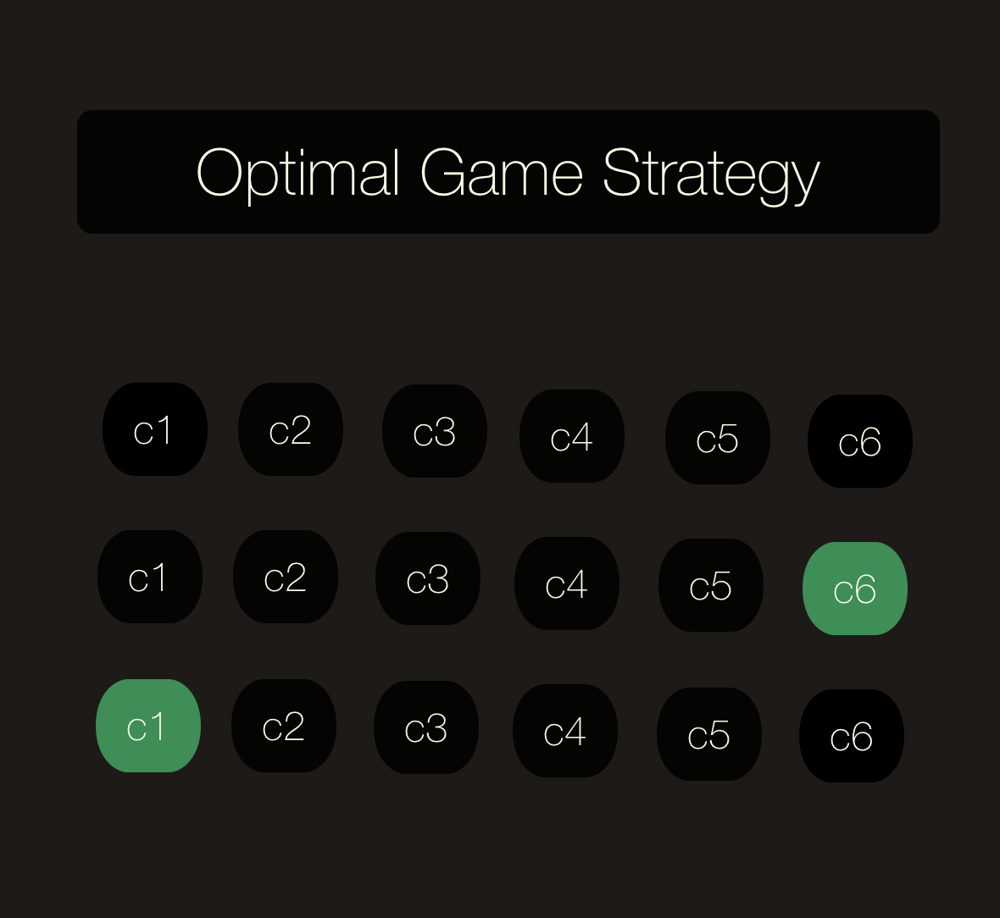
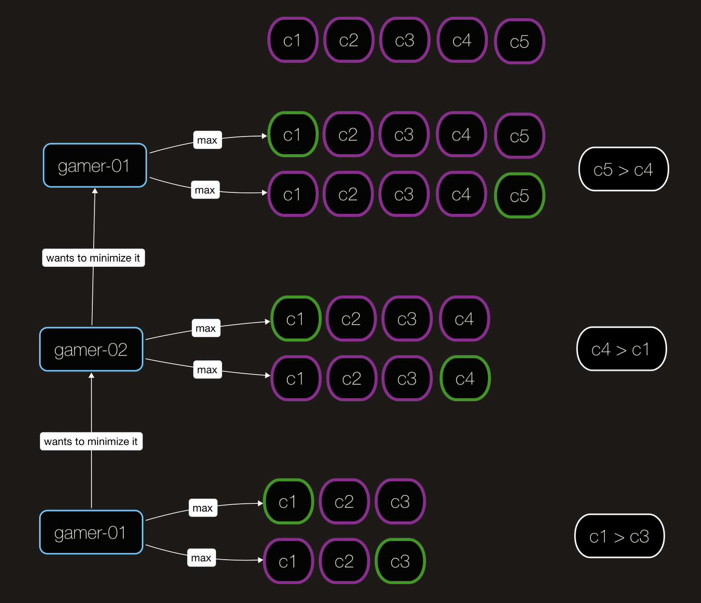
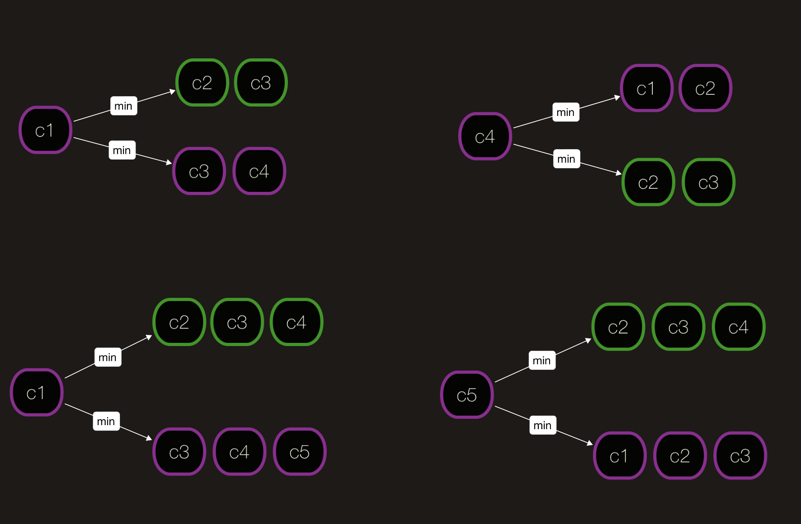
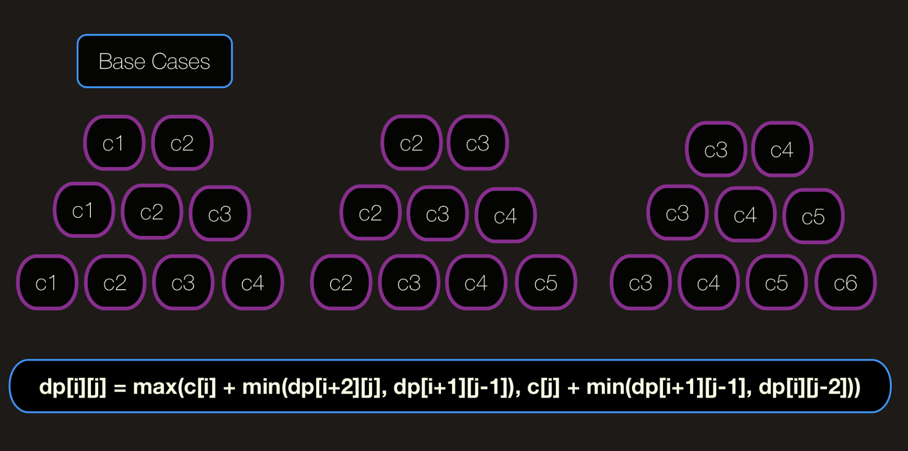

# Optimal Game Strategy - part1 [spontaneous]

Some of the well-known CS problems, such as the choosing of an optimal game strategy, may appear to be mentally exhausting at first glance. However, like with other problems, it necessitates a certain point of view from which we must examine it. First and foremost, let us define the problem:
> This is a game for two players. There are an even amount of coins placed in a row, hence the row is even. There will be alternating turns. Each round, a player has the option of selecting either the first coin in the row or the last coin in the row and keeping it in his possession. If a player moves first, the goal of the issue is to figure out how much money he or she can earn with certainty up to the greatest amount conceivable.
>

<p align="center">

</p>

Let's think the problem from three different perspectives:
 - we are player-1 and putting ourselves in place of player-2 (game theory) [or vice versa]
 - We only have a minimal number of coins (it's a bit of a bottom-up approach).
 - We have a large number of coins (in a sort of top-down fashion).

**Perspective#1 (minimax game):**
Minimax is a decision rule in game theory that is used to minimize the worst-case potential loss; in other words, a player evaluates all of the best opponent answers to his plans and picks the approach that provides the opponent's best strategy the largest possible payout.
Because it is important to minimize the loss incurred when an opponent chooses the strategy that causes the greatest possible loss, the term "minimax" is used to describe a strategy that is useful in analyzing the first player's decisions when the players move sequentially and when the players move simultaneously. In the latter situation, if certain additional requirements are met, minimax may result in a Nash equilibrium of the game being reached.
Minimax is also helpful in combinatorial games, in which a payout is allocated to each location in the game board. The most straightforward example is awarding a "1" to a winning position and a "-1" to a losing position; however, because this is difficult to compute for all but the simplest games, intermediate evaluations (particularly determined for the game in question) are often required. When playing in this context, the first player's objective is to maximize the assessment of the position, and the second player's purpose is to decrease the evaluation of the position, the minimax rule comes into play. The "naive" version of minimax is, in essence, the way computers approach games like as chess and Go, while numerous computing enhancements may be made to the "naive" implementation.

Suppose player-i chooses strategy si, and the remaining players choose the strategy profile s(-i). If ui(S) denotes the utility function for player-i on strategy profile s, the minimax of a game is defined as

> <p align="center">u(i) = min[s-i]max[si]u[i](s(i), s(-i)) </p>
>

In terms of intuition, the minimax (for player-i) may be expressed as one of two equivalent formulations:
The minimax is the minimum amount of money that the other players may compel player-i to accept without knowing what player-strategy i's is before the game begins.
When the minimax is informed about the strategies of all other players, he will be the player with the most value, I can assure that.
In the same way, the maximin is defined as
> <p align="center">u(i) = max[si]min[s-i]u[i](s(i), s(-i)) </p>
>

which can be intuitively understood as either of:
- The maximin is the largest value player-i can guarantee when he does not know the strategies of any other player
- The maximin is the smallest value the other players can force player-i to receive, while knowing player-i's strategy

<p align="center">

</p>


**Perspective#2 (thinking from bottom to up):**
Consider the scenario in which there are only 2 or 3 coins left on the table. What are some of the potential edge cases?
They can both choose from the front, or player-1 can choose from the front while player-2 can choose from the back (or vice versa).
Base case#1 -> there is only one coin on the table, take it.
Base case#2 -> there are two coins for choosing, take bigger of them. max(c[0], c[1])
<p align="center">

</p>


**State Relationship & Perspective#3:**
Player-1 wants the best, whereas Player-2 want the best for his/her own. For expression of the state on t moment, [start][end] indice are enough for us.
By considering upper ideas & perspectives state transformation can be expressed as like:

old_state -> new_state
 { [i+1][j-1], [i+2][j] } => {[i], [j]}
 dp[i][j] = max(c[i] + min(dp[i+2][j], dp[i+1][j-1]), c[j] + min(dp[i+1][j-1], dp[i][j-2]))

> if current turn is for player-1, previous was for player-2 and player-2 tried to minimize player-1's prev result OR maximize his/her result.
>

From the perspective#1 we can easily see that player-01 and player-02 wants to minimize each other's results. By considering P1 & P2 we can deduce the following state relationship:
<p align="center">

</p>


**Implementation:**
```cpp
#include<iostream>
using namespace std;
 
int findOptimum(int n, int coins[])
{
    int dp[n][n];
 
    //state variables for dp table, [start][end] available coins on the table
    int i,j;
 
    // initialization of dp table
    // base case#1, nCoin=1
    for(j=0;j<n;j++)
    {
        dp[j][j]=c[j];
    }
 
    // base case#2, nCoin=2, if we have 2 remaining coins: choose max(c[i], c[i+1])
    for(j=0;j<n-1;j++)
        dp[j][j+1]=max(c[j],c[j+1]);
 
    // building the dp table according to the perspective#1 and perspective#2
    for(i=2;i<n;i++)
    {
        //we will calculate result dp[j][j+i] start..end
        for(j=0;j+i<n;j++)
        {
            int x=c[j]+min(dp[j+2][j+i], dp[j+1][j+i-1]);
            int y=c[j+i]+min(dp[j+1][j+i-1], dp[j][j+i-2]);
 
            dp[j][j+i]=max(x,y);
        }
    }
 
    return dp[0][n-1];
}
```


**Further research:**
 - Why the number of coins is even?
 - Are there any other game theory tactics we might use?