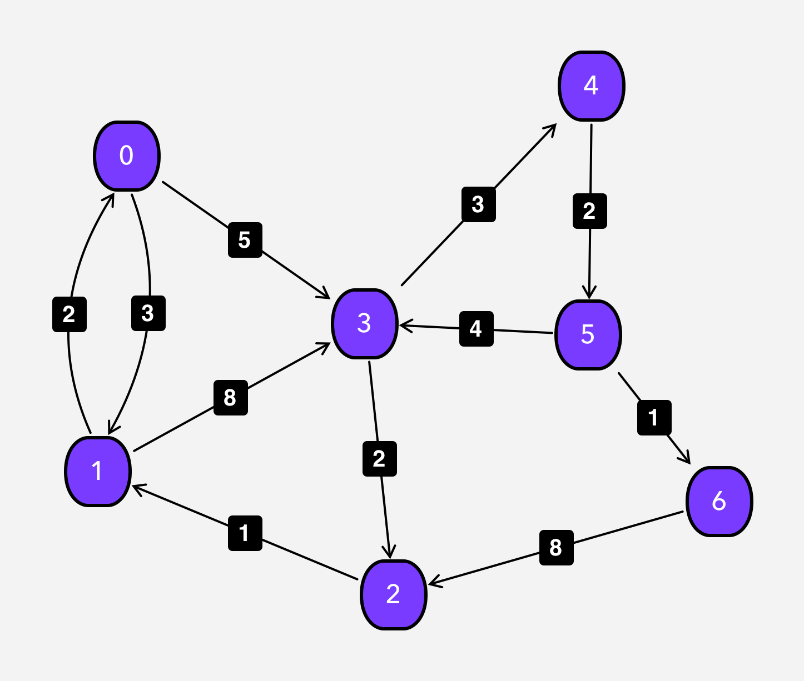

#  Floyd-Warshall [Why this idea works?]

When I saw this algorithm for a first time, It reminded me **the Matrix Chain Multiplication**, so therefore didn't think about that much "how does it work?", "why does it work?".
Because, MCM problem seems much more interval DP(anyway, it's acyclic DAG) because of it's vibe of linearity.<br/>
Let's think the problem gradually from simpler to harder, 1. graph is completely linear OR topologically sorted, 2. graph nodes have all the connections pairwise.
For simplicity, let's look at linear graph model.

<p align="center">

</p>

We want to find shortest path between all vertices pairwisely.
<p align="center">

</p>

> Most of the resources about this algorithm shows last state dimension reduced version. So therefore, it's not that much intuitive for understanding.
>

In linear graph model, let's think this problem from the combinatorial mind. We can go from 0th vertice to the 3rd vertice via just one path [0->1->2->3]. We can reduce this problem into Matrix Chain Multiplication.
> <p align="center"> dp[i][j] = min(dp[i][j], dp[i][k]+dp[k][j]) {for k:0..3} </p>
>

**Harder version:**
<p align="center">


</p>

<p>From the combinatorial mind perspective, if we want to go from 0th node to 6th node. How many different options do we have?</p>
    1. [0->1->3->4->5->6]
    2. [0->3->4->5->6]

<p>If we are on 0th node, for going to 6th we have 2 options:</p>
    1. Go to the 1st node [Consider the 1st node or NOT]
    2. Go to the 3rd node [Consider the 3rd node or NOT]
<p>For the 1st node and the 3rd node we also have different choices. This makes our Decision Tree for the path.</p>

<p align="center">

</p>

**State Relationship & Recurrence Relations:**<br/>
By considering the above perspective, we can arrange recurrence relation as following:<br/>
**Distance(i, j, k) = min(Distance(i, j, k-1), Distance(i, k, k-1) + Distance(k, j, k-1))**<br/>
Distance(i, j, k) means i to j by considering k vertices, it doesn't mean k'th (or 0..k) vertex will definitely participate on path. It might or not participate (depends on minimum distance).
for example: dp[0][6][6] = min(dp[0][6][5], dp[0][1][5]+dp[1][5][5])
<p align="center">

</p>

**State Space Reduction:**<br/>
As we can see, k'th state only depends on (k-1)th state. Therefore, we can reduce from 3D [i][j][k] into [i][j] 2D state.
<p align="center">

</p>

**Implementation:**
```python
# implementation by the brilliant team (!)
# time complexity: O(n^3)
class Edge:
    def __init__(self, start, end, weight):
        self.start = start
        self.end = end
        self.weight = weight

class Graph:
    def __init__(self):
        self.adj = {} #Adjacency matrix that holds graph data
        self.vertexCount = 0

    def addVertex(self, vertex):
        if vertex in self.adj:
            return "Vertex already exists"
        if vertex != self.vertexCount:
            return "Don't skip a vertex"
        self.adj[vertex] = []
        self.vertexCount += 1

    def addEdge(self, start, end, weight):
        if start not in self.adj:
            return "Starting vertex not in graph"
        if end not in self.adj:
            return "Ending vertex not in graph"
        if start == end:
            return "Cannot have same start and end vertex"
        edge = Edge(start, end, weight)
        self.adj[start].append(edge)

    def doesEdgeExist(self, start, end):
        for vertex in self.adj:
            for edge in self.adj[vertex]:
                if edge.start == start and edge.end == end:
                    return (True, edge)
        return (False, None)

    def floydwarshall(self):
        M = [[99999 for x in range(len(self.adj))] for y in range(len(self.adj))]
        for x in range(len(M)):
            for y in range(len(M[0])):
                if x == y:
                    M[x][y] = 0
                exists, edge = self.doesEdgeExist(x, y)
                if exists:
                    M[x][y] = edge.weight
        for k in range(len(M)):
            for i in range(len(M)):
                for j in range(len(M)):
                    M[i][j] = min(M[i][j], M[i][k] + M[k][j])
        return M
```


**Further research:**
 - Can we optimize this approach for big numbers? (because of time complexity)