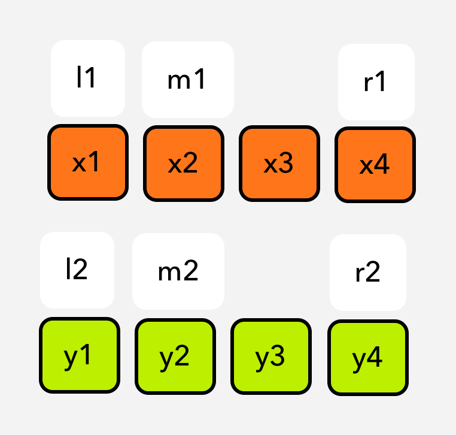
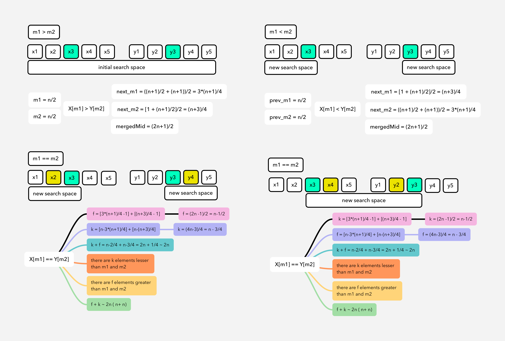
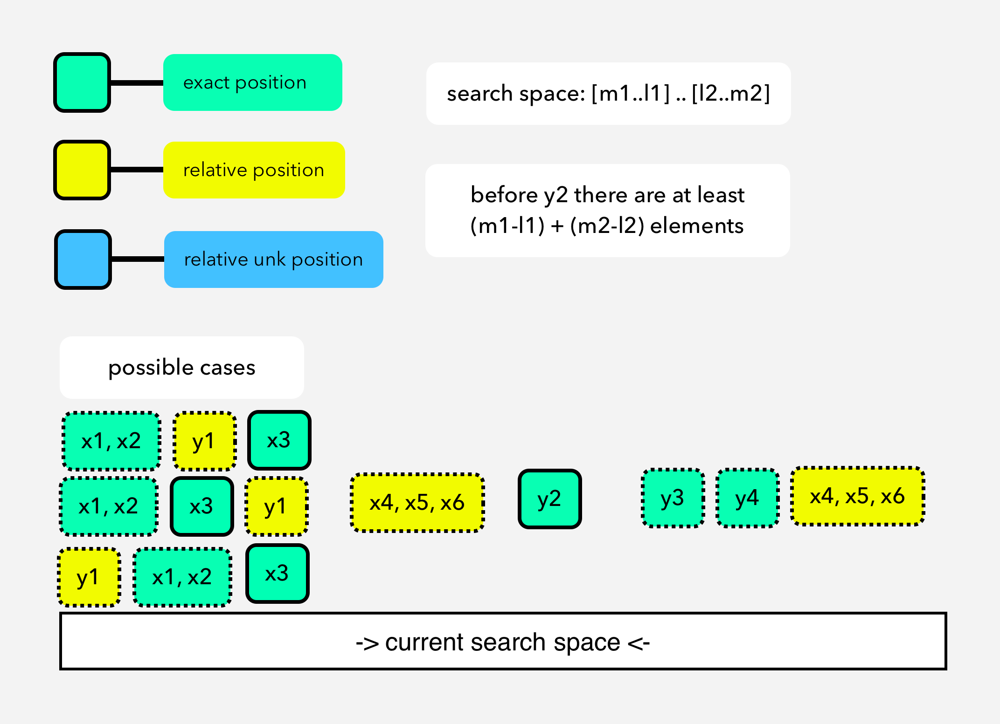
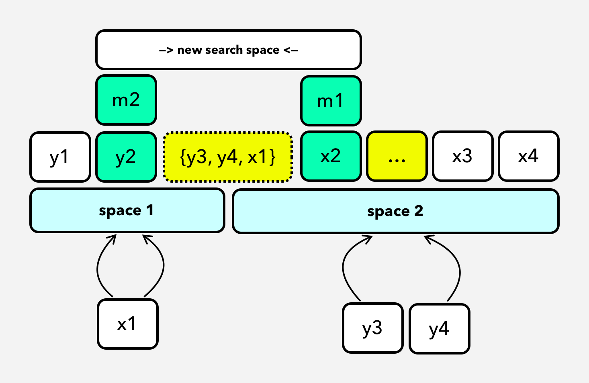
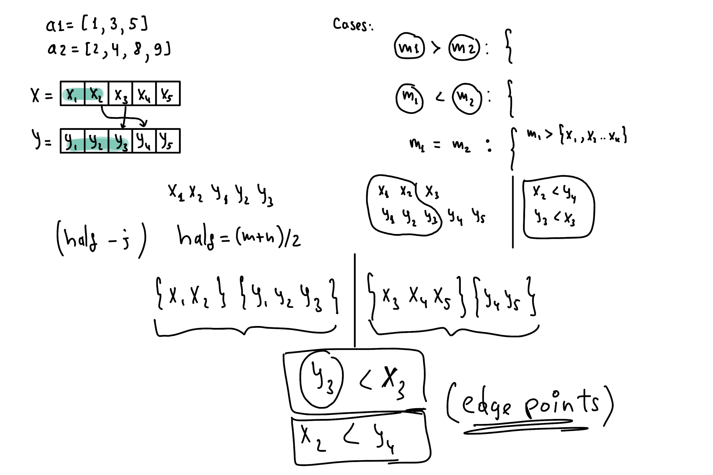

# Median Of Two Sorted Arrays [Hidden Patterns of Binary Search]

> Problem: Given two sorted arrays nums1 and nums2 of size m and n respectively, return the median of the two sorted arrays. The overall run time complexity should be O(log (m+n)).

Everytime I murmuring, if there is some kind of sortedness, there is hidden patterns of binary search usage there ;)
First and very basic idea is to merge two arrays and sort them. But in case of sorting merged arrays we will not use (dismiss) the sortedness feature of arrays. But if we can make some clever observations, it can help us to think about the O(log(n)) solution.

## Simpler Version [same & odd size]

As everytime, let’s think simpler version first, both arrays **have the same & odd size.**

<p align="center">

</p>

> What is median?
> The median is the value separating the higher half from the lower half of a data sample, a population, or a probability distribution. For a data set, it may be thought of as "the middle" value. [source: wikipedia]

**Observation#1:**
Do we need all the elements of the array to calculate median?
Actually, NO.

**Observation#2:**
Let’s think that we have two sorted arrays:
x = [x1, x2, x3]<br/>
y = [y1, y2, y3]<br/>
As per their sortedness, we can extract these implications:
if x2 > y2, then x2 > {y1} as well.
if y2 > x2, then y2 > {x1} as well.

According to these key observations, let’s think about the solution gradually.
As per the **observation#1** we need only middle element(s) to find a median of merged array. Can we reduce our search space by ignoring the elements using **observation#2**?
Before reducing our search space, we have to think about our search space.
What is the way of reducing our search space in log(N) time? - # Binary Search.

**There could be 3 edge cases: [m1==m2, m1>m2, m1<m2]**<br/>
**Case 1 if (m1 == m2)**: Ignore [l1:m1) & (m2:r2], there is not any element between m1 and m2.<br/>
**Case 2 if (m1 < m2)**: Ignore [l1:m1) & (m2:r2], there are elements between m1 and m2.<br/>
**Case 3 if (m1 > m2)**: Ignore (m1:r1] & [l2:m2)<br/>

<p align="center">

</p>

**Implementation:**

```python
# implementation by A.Kh
# time complexity: T(2n) + c  = T(x/2) + c/2 = O(logn)
def getMedian(A, size):
    if (n % 2 == 0):
        return (A[size/2 - 1] + A[size/2])/2
    return A[size/2]

def solve(X, Y, msize):
    if msize==0:
        return 0

    # remaining 1 elements in each of them [X, Y]
    if msize == 1:
        return (X[0] + Y[0])/2

    m1 = getMedian(X, msize)
    m2 = getMedian(Y, msize)

    if m1 == m2:
        return m1
    elif m1 < m2:
        return solve(X[msize/2:], Y[:msize/2], msize - msize/2)
    elif m1 > m2:
        return solve(X[:msize/2], Y[msize/2:], msize - msize/2)
```

<p></p>

## A Bit Harder Version [same & (even || odd) sizes]

Let's assume at the end of divide & conquer recursion there are 2 elements remaining in each array (X & Y).
How would you calculate median for these remaining elements?<br/>
**Abstract thinking:** There are n==2 elements in each X & Y at the end of recursion. x1...xk-2 **[{xk-1, xk} {yk-1, yk}]** y1...yk-2 <br/>
Median will be avg of exact middle point two elements in **[{xk-1, xk} {yk-1, yk}]**.<br/>
How two choose those two values in four?<br/>
Because of their sortedness, we know that: **xk-1 <= xk, yk-1 <= yk**.
Then, elements arrangement near middle area will be like: <br/>
min(xk-1, yk-1), **max(xk-1, yk-1), min(xk, yk)**, max(xk, yk), OR <br/>
min(xk-1, yk-1), **min(xk, yk), max(xk-1, yk-1)**, max(xk, yk). <br/>
**Median**: (min(xk, yk) + max(xk-1, yk-1))/2.0 <br/>
Also, for the search space size, we have to include +1 more space to include element when the size is even.<br/>
**Implementation:**

```python
# implementation by A.Kh
# time complexity: T(2n) + c  = T(x/2) + c/2 = O(logn)
def getMedian(A, size):
    if (n % 2 == 0):
        return (A[size/2 - 1] + A[size/2])/2
    return A[size/2]

def solve(X, Y, msize):
    if msize = 0:
        return 0
    # remaining 1 elements in each of them [X, Y]
    elif msize == 1:
        return (X[0] + Y[0])/2
    # remaining n==2 elements in each of them [X, Y]
    elif msize==2:
        return (max(X[0], Y[0]) + min(X[1], Y[1]))/2.0

    m1 = getMedian(X, msize)
    m2 = getMedian(Y, msize)

    if m1 == m2:
        return m1
    elif m1 < m2:
        if msize%2 == 0:
            return solve(X[msize/2-1:], Y[:msize/2+1], m-msize/2+1)
        return solve(X[msize/2:], Y[:msize/2], msize - msize/2)
    elif m1 > m2:
        if msize%2 == 0:
            return solve(X[:msize/2+1], Y[msize/2-1:], m-msize/2+1)
        return solve(X[:msize/2], Y[msize/2:], msize - msize/2)
```

<p></p>

## Hard Version [different & (odd || even) sizes]

Arrays can have different dimensions.
Dividing by half is not obvious here, but we can see an easter-egg **observation#3**.<br/>
**Observation#3:**<br/>
Let’s think that we have two sorted, different size arrays:
x = [x1, x2, x3]
y = [y1, y2]
merged_array = [i1, i2, i3, i4, i5] {i -> x, y}

<p align="center">

</p>

<p align="center">

</p>

As you can see here it's hard to directly apply divide & conquering. We need to reduce this problem into more manageable pieces. At the end of day, we need to find middle element(s) of abstractly merged arrays.<br/>
As an extenstion to the **observation#1**, to get median of merged array, we need only middle element(s). So?
**Core Idea:** By using sortedness, can we put such a partition points in x & y which will make first part of the merged array? (up to middle point = (n+m)/2 or (n+m+1)/2)
Let’s see it.
We need to find such a points in each X & Y. It means position of these pointers will be dependent on each other.Because:<br/>
**[leftPointerX + leftPointerY == (len(X)+len(Y)+1/2)]** <br/>
Another most important observation is: <br/>
**Left elements around middle point should be lesser than right elements. This observation will be main condition for our Binary Search Convergence.**

<p align="center">

</p>

```python
# implementation by A.Kh
# time complexity: O(log(len(X)))
def solve(self, X , Y):
        n = len(X)
        m = len(Y)
        if (n > m):
            return solve(Y, X)  # Swapping to make X smaller

        start = 0
        end = n
        mergedMid = (n + m + 1) // 2

        while (start <= end):
            mid = (start + end) // 2
            leftXsize = mid
            # Y's left pointer is dependent on leftX pointer
            leftYsize = mergedMid - leftXsize

            # checking overflow of indices
            # elements before 0th index will be minus infinity (for keeping this conditon TRUE: leftX <= rightY)
            # cause there could be edge case: Array X will be completely after Y
            leftX = X[leftXsize - 1] if (leftXsize > 0) else float('-inf')
            # cause there could be edge case: Array Y will be completely after X
            leftY = Y[leftYsize - 1] if (leftYsize > 0) else float('-inf')
            rightX = X[leftXsize] if (leftXsize < n) else float('inf')
            rightY = Y[leftYsize] if (leftYsize < m) else float('inf')

            # correct partition is found
            if leftX <= rightY and leftY <= rightX:
                if ((m + n) % 2 == 0):
                    return (max(leftX, leftY) + min(rightX, rightY)) / 2.0
                return max(leftX, leftY)
            # X size is bigger, decrease X's size, increase Y's size for keeping leftX <= rightY
            elif leftX > rightY:
                end = mid - 1
            # Y size is bigger, increase X's size, decrease Y'size for keeping leftY <= rightX
            elif leftY > rightX:
                start = mid + 1
```

**Further research:**

- Can we approach this problem as an Order Statistics problem? (finding (k-1)th and kth elements?).
- There are diffent but less efficient approaches like mergeSort for this problem (think about it).
